# Préparez votre environnement

Afin de réaliser ce workshop, vous aurez besoin de deux éléménts : 

- Une souscription à Azure,
- Un ensemble d'outils, et notamment Visual Studio Code, afin d'écrire et 
de déployer du code à la fois sur un objet IoT et sur le cloud.

::: danger Attention
Si vous lisez ce workshop sans être accompangé d'un employé Microsoft, certaines parties du workshop ne seront pas 
réalisables dans cet ordre. Nous sommes en train de préparer une nouvelle version qui vous permettra de le réaliser.
:::

## Configurer son compte Azure

Il existe différentes manières d'obtenir un abonnement à Microsoft Azure. 
Cet abonnement est nécessaire afin de créer les ressources Azure pour ce workshop.
La majorité des ressources utilisées le seront dans les limites des tiers gratuits, 
il se peut cependant que des frais soient occasionnés en suivant ce workshop.

Afin de vous aider à créer votre compte Azure, choisissez l'option qui 
correspond le mieux à votre situation :

- [J'ai déjà un abonnement](#j-ai-deja-un-abonnement-azure)
- [Je suis étudiant](#je-suis-etudiant)
- [Je suis un abonné MSDN/Visual Studio](#je-suis-un-abonne-visual-studio-msdn)
- [J'ai un Azure Pass](#un-employe-microsoft-m-a-communique-un-azure-pass)
- [Je n'ai rien de tout cela](#je-n-ai-rien-de-tout-cela)


### J'ai déjà un abonnement Azure

C'est une excellente nouvelle ! Il faudra toutefois veiller à vérifier que vous avez les autorisations nécessaires
afin de pouvoir créer des ressources sur cet abonnement. 

Vous pouvez maintenant [vérifier si tout est prêt pour la prochaine étape](#✅-verifions-si-votre-compte-azure-a-bien-ete-cree).

### Je suis étudiant

En tant qu'étudiant, vous avez probablement accès à l'offre **Azure For Students**.
Pour le savoir, rendez-vous sur la [page dédiée][azure-student], et cliquez sur **Activate Now**.
On vous demandera alors de confirmer vos informations personnelles, ainsi que votre numéro de téléphone afin de recevoir
un SMS de validation.

::: warning Attention
Si, à un moment dans le parcours d'inscription, vos informations de carte bleue vous sont demandées, 
c'est probablement qu'il y a eu une erreur dans le parcours.
:::

Il se peut que votre portail étudiant vous amène directement sur le portail Azure, sans toutefois avoir de souscription
Azure. Dans ce cas, recherchez "Education" dans la barre de recherche en haut à droite. Sur cette page éducation,
cliquez sur le bouton **Claim your Azure credit now** afin de démarrer le processus de création d'abonnement.
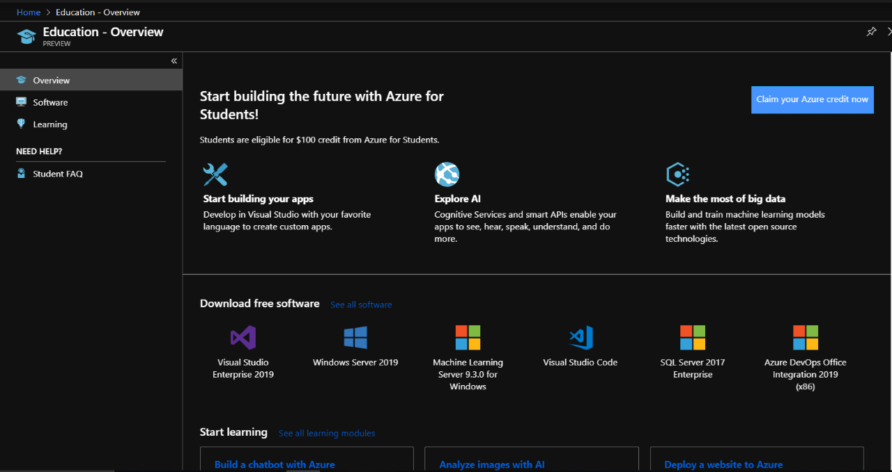

Dans le cas où votre établissement d'enseignement ne serait pas reconnu, vous pouvez toujours 
[créer un abonnement d'essai](#nothing).

Vous pouvez maintenant [vérifier si tout est prêt pour la prochaine étape](#✅-verifions-si-votre-compte-azure-a-bien-ete-cree).

### Un employé Microsoft m'a communiqué un _Azure Pass_

Vous êtes sur un événement et un employé vous a communiqué un code _Azure Pass_? Dans ce cas
vous pouvez l'utiliser afin de créer un abonnement. Avant de démarrer, assurez-vous : 

- d'avoir un compte Microsoft (anciennement Live). Vous pouvez en créer un sur [account.microsoft.com](https://account.microsoft.com),
- que ce compte n'a jamais été utilisé pour un autre abonnement Azure. Si vous avez déjà eu un compte d'essai ou payant
avec la même adresse, il vous sera alors impossible d'utiliser l'Azure Pass.

::: warning Attention
Si, à un moment dans le parcours d'inscription, vos informations de carte bleue vous sont demandées, 
c'est probablement qu'il y a eu une erreur dans le parcours. Demandez de l'aide à l'employé Microsoft.
:::

1. Rendez-vous sur [microsoftazurepass.com][azurepass] et cliquez sur **Start**,
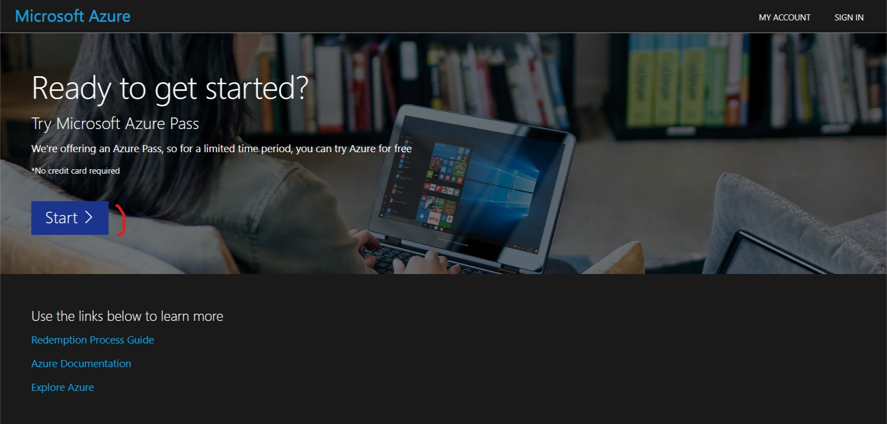
2. Connectez vous avec un compte Microsoft Live **Vous devez utiliser un compte Microsoft qui n'est associé à aucune
 autre souscription Azure**
3. Vérifiez l'email du compte utilisé et cliquez sur **Confirm Microsoft Account**
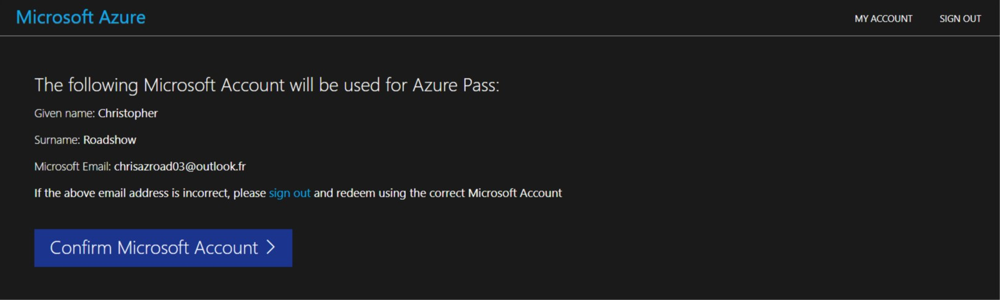
4. Entrez le code que nous vous avons communiqués, puis cliquez sur **Claim Promo Code** (et non, le code présent sur la
 capture d'écran n'est pas valide ;) ),
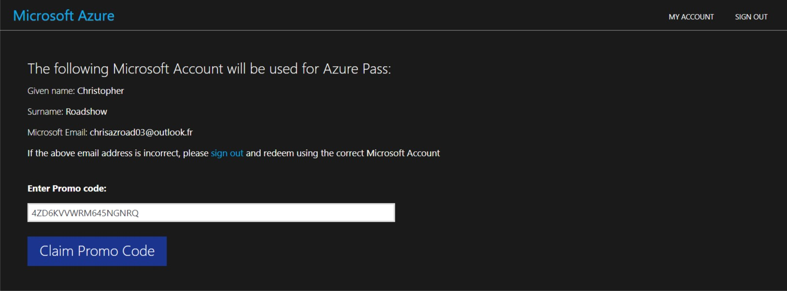
5. Nous validons votre compte, cela prend quelques secondes
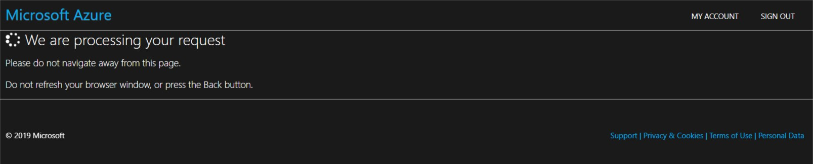
6. Nous serez ensuite redirigé vers une dernière page d'inscrption. Remplissez les informations, puis cliquez sur **Suivant**
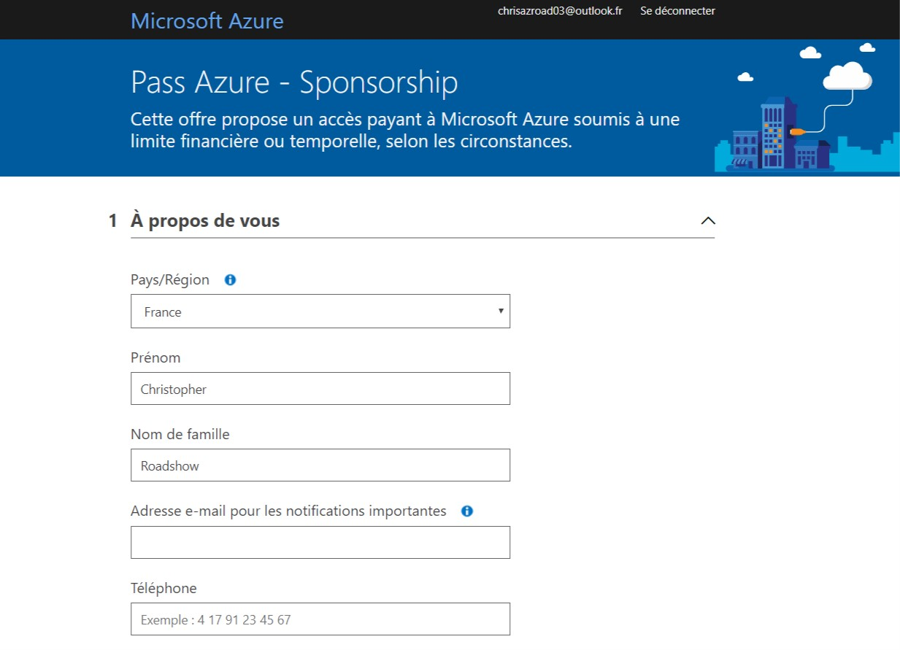
7. Il ne vous restera plus que la partie légale: accepter les différents contrats et déclarations. Cochez les cases que 
vous acceptez, et si c'est possible, cliquez sur le bouton **Inscription**
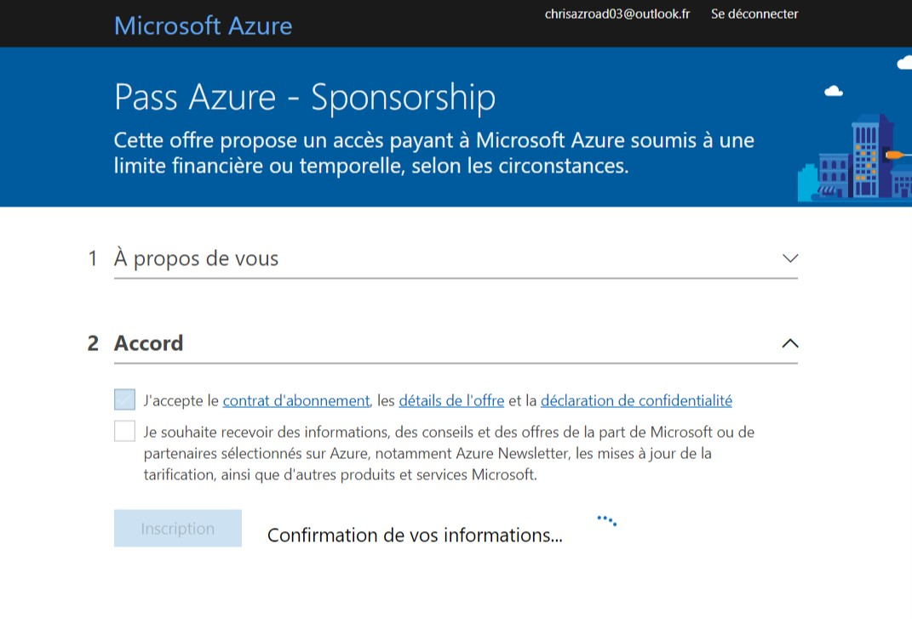

Encore quelques minutes d'attente, et voilà, votre compte est créé ! Prenez quelques minutes afin d'effectuer la 
visite et de vous familiariser avec l'interface du portail Azure.

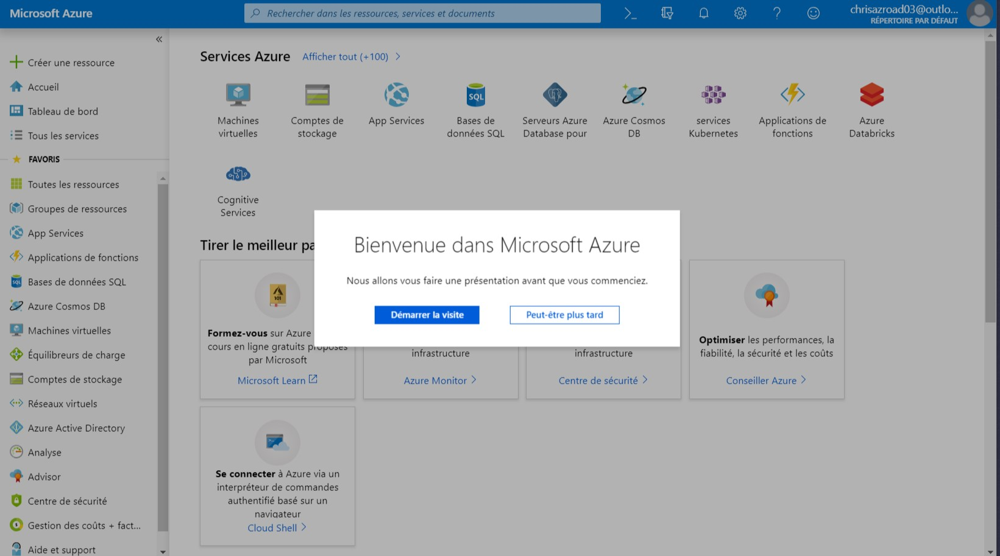

Vous pouvez maintenant [vérifier si tout est prêt pour la prochaine étape](#✅-verifions-si-votre-compte-azure-a-bien-ete-cree).

### Je suis un abonné Visual Studio / MSDN

Vous avez accès à un crédit mensuel gratuit dans le cadre de votre abonnement. Si vous ne l'avez pas déjà activé,
il suffit d'aller sur la [page dédiée](https://azure.microsoft.com/en-us/pricing/member-offers/credit-for-visual-studio-subscribers/?wt.mc_id=blinkingcompressor-github-chmaneu)
puis de cliquer sur le bouton **activer**.

Vous pouvez maintenant [vérifier si tout est prêt pour la prochaine étape](#✅-verifions-si-votre-compte-azure-a-bien-ete-cree).

### Je n'ai rien de tout cela

Vous pouvez toujours créer un [abonnement d'essai][azure-free-trial]. Les informations de carte bleue vous seront
demandées afin de s'assurer que vous êtes une personne physique.

Vous pouvez maintenant [vérifier si tout est prêt pour la prochaine étape](#✅-verifions-si-votre-compte-azure-a-bien-ete-cree).

### ✅ Vérifions si votre compte Azure a bien été créé

Avant de passer à l'étape suivante, nous allons nous assurer que votre souscription
a bien été créée. Pour cela, quelques étapes suffisent : 

1. Rendez-vous sur [le portail Azure][azure-portal],
2. Dans la barre de recherche en haut de la page web, entrez "Subscriptions", puis cliquez sur
l'élément 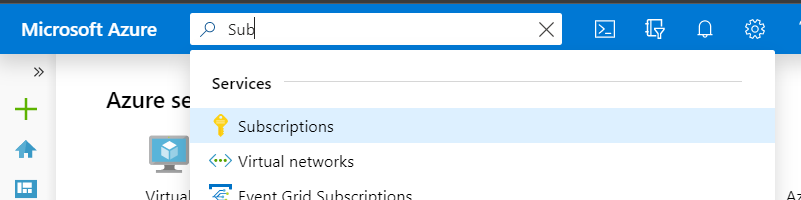
3. Une liste apparaît, dans laquelle vous devez avoir un élément avec un status Actif 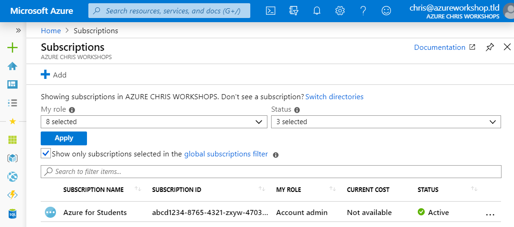

>La capture d'écran indique un nom d'abonnement _Azure for Students_. Ce nom
>peut différer en fonction du type d'abonnement Azure, ainsi que de qui l'a créé.
>Il est en effet possible de rennomer son abonnement avec un nom plus de

**Félicitations**, vous pouvez désormais passer au module suivant 🥳

[azurepass]: https://www.microsoftazurepass.com/?wt.mc_id=blinkingcompressor-github-chmaneu
[azure-portal]: https://portal.azure.com/?feature.customportal=false&wt.mc_id=blinkingcompressor-github-chmaneu
[azure-free-trial]: https://azure.microsoft.com/en-us/free/?wt.mc_id=blinkingcompressor-github-chmaneu
[azure-student]: https://azure.microsoft.com/en-us/free/students/?wt.mc_id=blinkingcompressor-github-chmaneu

## Configurer son environnement de développement

### Module Azure Functions

Pour le module _Détectez l'activité du compresseur avec une Azure Function_, 
il vous sera nécessaire d'installer les éléments suivants sur votre poste de 
développement: 

- [Visual Studio Code][vscode-home] ainsi que quelques extensions
    - L'extension [Azure Tools][vscode-azureext],
    - Les extensions pour les langages que vous allez utiliser
        - [C#][vscode-csharpext],
        - Python (**3.6** et non pas 3.7)
        - Java
        - JavaScript/NodeJS est déjà inclus :)

[vscode-home]: https://code.visualstudio.com/?wt.mc_id=blinkingcompressor-github-chmaneu
[vscode-azureext]: https://marketplace.visualstudio.com/items?itemName=ms-vscode.vscode-node-azure-pack&wt.mc_id=blinkingcompressor-github-chmaneu
[vscode-csharpext]: https://marketplace.visualstudio.com/items?itemName=ms-vscode.csharp&wt.mc_id=blinkingcompressor-github-chmaneu    

### Module _Connectez vos devices IoT au Cloud_

Pour ce module, vous aurez besoin d'un certain nombre de composants. Le MXChip étant une board Arduino,
il vous faudra installer pas mal de choses. Je vous conseille de lancer l'installation en parallèle de la réalisation
du second module. 

- [Visual Studio Code][vscode-home] ainsi que quelques extensions
    - L'extension [Azure IoT tools][vscode-iottoolsext] ([Installer](vscode:extension/vsciot-vscode.azure-iot-tools)), qui contient notamment _IoT Workbench_,
    - L'extension [Arduino][vscode-arduinoext] de l'éditeur Microsoft,
    
- [Arduino IDE][arduino-ide]: il contient les outils de builds et de déploiment pour la carte MXChip. **Attention:** Installez la version "standalone", et non pas la version du Store.
- Le driver _ST-Link_: 
	* Windows
	Télécharger et installer le driver depuis le site [STMicro](http://www.st.com/en/development-tools/stsw-link009.html).

	* macOS
	Pas de driver nécessaire

	* Ubuntu
  	Exécuter la commande suivante dans votre terminal, puis déconnectez/reconnectez-vous afin d'appliquer le changement 
    de permissions. Lisez la note ci-dessous avant.

		```bash
		# Copy the default rules. This grants permission to the group 'plugdev'
		sudo cp ~/.arduino15/packages/AZ3166/tools/openocd/0.10.0/linux/contrib/60-openocd.rules /etc/udev/rules.d/
		sudo udevadm control --reload-rules
		
		# Add yourself to the group 'plugdev'
		# Logout and log back in for the group to take effect
		sudo usermod -a -G plugdev $(whoami)
		```

> Vous êtes sous Ubuntu ? Cette dernière étape est à réaliser à la fin de cette partie. En effet, le dossier 
`packages/AZ3166` est créé lors d'une prochaine étape.

Une fois l'ensemble de ces composants installés, il faudra s'assurer que Visual Studio Code puisse utiliser l'installation
d'Arduino. Ouvrir **File > Preference > Settings** et faites une recherche sur "Arduino". Vous verrez alors
un bouton vous permettant d'éditer les URLs additionnelles dans le fichier `settings.json`.
Il suffit alors d'ajouter les lignes ci-dessous à votre configuration.

::: tip Note
Il est également possible d'ouvrir directement les settings avec l'éditeur JSON en utilisant la commande
`Preferences: Open Settings (JSON)`.
:::

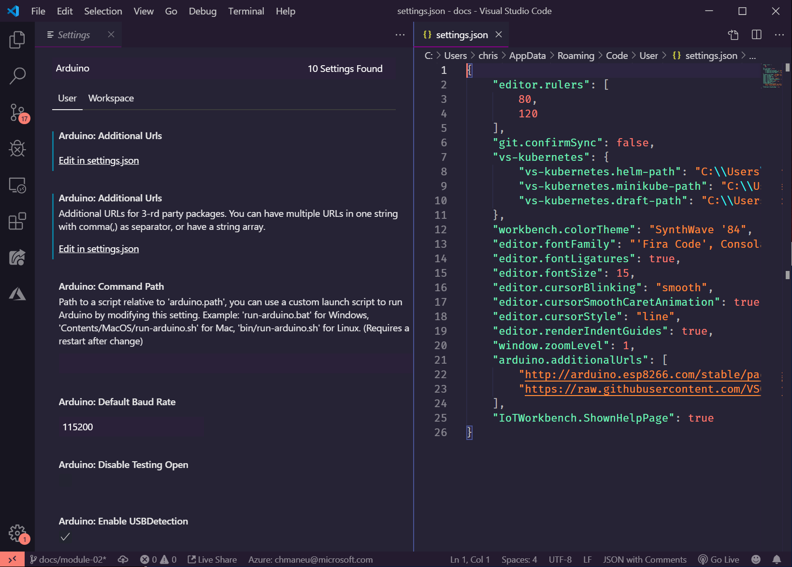

Voici les valeurs par défaut à ajouter à cette configuration:

* Windows

```JSON
"arduino.path": "C:\\Program Files (x86)\\Arduino",
"arduino.additionalUrls": "https://raw.githubusercontent.com/VSChina/azureiotdevkit_tools/master/package_azureboard_index.json"
```

* macOS

```JSON
"arduino.path": "/Applications",
"arduino.additionalUrls": "https://raw.githubusercontent.com/VSChina/azureiotdevkit_tools/master/package_azureboard_index.json"
```

* Ubuntu

```JSON
"arduino.path": "/home/{username}/Downloads/arduino-1.8.5",
"arduino.additionalUrls": "https://raw.githubusercontent.com/VSChina/azureiotdevkit_tools/master/package_azureboard_index.json"
```

**Pensez à sauvegarder vos paramètres avant de passer à l'étape suivante !**

Enfin il faudra ajouter le SDK spécifique pour la board Arduino MXChip. Pour cela, via la palette de commande (`Ctrl+Shift+P`
 ou `Cmd+Shif+P`), ouvrir la page **Arduino: Board Manager**, et rechercher **AZ3166**, puis installer la version `1.6.0`.


### Connecter votre board au WiFi

Votre board est normalement déjà configurée. Si vous deviez la reconnecter au WiFi, vous trouverez
[les instructions ici](configure-wifi.md).


[arduino]: https://www.arduino.cc
[vscode-csharpext]: https://marketplace.visualstudio.com/items?itemName=ms-vscode.csharp&wt.mc_id=blinkingcompressor-github-chmaneu
[arduino-ide]: https://www.arduino.cc/en/Main/Software
[vscode-iottoolsext]: https://marketplace.visualstudio.com/items?itemName=vsciot-vscode.azure-iot-tools&wt.mc_id=blinkingcompressor-github-chmaneu
[vscode-arduinoext]: https://marketplace.visualstudio.com/items?itemName=vsciot-vscode.vscode-arduino&wt.mc_id=blinkingcompressor-github-chmaneu
[vscode-azureext]: https://marketplace.visualstudio.com/items?itemName=ms-vscode.vscode-node-azure-pack&wt.mc_id=blinkingcompressor-github-chmaneu