# Détectez l'activité du compresseur avec Azure Functions

> Si vous réalisez ce workshop seul, sans quelqu'un de l'équipe relations
> développeurs, alors il vous faudra réaliser le module 3 "Connectez vos devices
> IoT au Cloud" avant de réaliser ce module.

### Ce que l'on cherche à réaliser

Nous avons déjà connecté les boards au cloud pour vous (vous pourrez le faire 
vous-même dans le prochain module). Nous avons besoin de vous afin de détecter
d'après les données des capteurs si le compresseur est en fonctionnement ou non.

Vous allez donc développer une API REST à l'aide d'Azure Functions qui sera appelée
dès que la carte IoT enverra une nouvelle donnée. A vous de créer un super algo
qui retournera l'état du compresseur :grinning:.

### Qu'est ce qu'Azure Function ?

Azure Functions est un des services _serverless_ d'Azure. Il vous permet de développer
des "fonctions" de code qui seront exécutées à la demande, avec un paiement à l'usage
ainsi qu'un auto-scaling. 

Il est possible de développer des Azure Functions avec un ensemble de langages: Java, Python, C#, Node.JS, etc...
Une fois développé, les Azure Functions peuvent être hébergées sur Azure, mais également sur d'autres clouds, sur 
vos serveurs - via une image Docker - et même sur des devices IoT !

### Comment développer une Azure Function ?

Vous avez deux possibilités pour développer une Azure Function : 

- **Via le portail Azure**: avec une expérience entièrement dans votre navigateur. Cela est pratique 
pour faire quelques tests, ou un petit PoC,
- **Sur votre poste de développement (Windows, Mac, Linux)**: avec Visual Studio ou Visual Studio Code. C'est
la solution recommandée pour des projets de production.

## Créer une Fonction dans VS Code

Visual Studio Code vous permet de créer et de tester votre code en local, souvent sans accès à Internet. Il est ensuite
possible de déployer directement votre code dans une Azure function, ou via un pipeline d'intégration/déploiement continu.

Si vous n'avez pas Visual Studio Code, vous pouvez également [développer votre fonction dans le portail Azure](#creer-une-azure-function-⚡-dans-le-portail-azure-👩‍💻).

### Créer le projet

Pour créer un projet Azure Functions, lancez la barre de commandes (_Ctrl+Shift+P_), et recherchez la commande
`Azure Functions: Create New Project...`. Choisissez un répertoire vide et répondez aux options de création du projet: 

- **Le langage**: Vous pouvez choisir n'importe quel langage pour ce projet,
- **Le trigger**: C'est l'élément qui va venir déclencher l'exécution de votre fonction. Dans le cas d'une API REST, il 
faudra sélectionner _HTTP trigger_,
- **Un nom de fonction**: Ce nom doit être prédictif (j'ai choisi `prediction`). Par défaut, ce sera également une partie
de l'URL
- **Le type d'autorisation**: Est-ce que votre fonction doit être accessible sans authentification, ou avec une clé. Pour
ce workshop, vous êtes libres de choisir l'une des deux méthodes, mais je vous encourage à sélectionner _Function_. Prenons 
de bonnes habitudes :).
- **Comment souhaitez-vous ouvrir le projet**: dans une nouvelle fenêtre VS Code ou dans la même.

<div class="img-inline">


</div>

Une fois ces options choisies, VS Code va automatiquement vous créer un squelette de projet et de fonction. Il exécutera
ensuite des tâches nécessaires en fonction du langage: créer un environnement virtuel en python, faire un package restore
en NodeJS ou en .Net, etc...

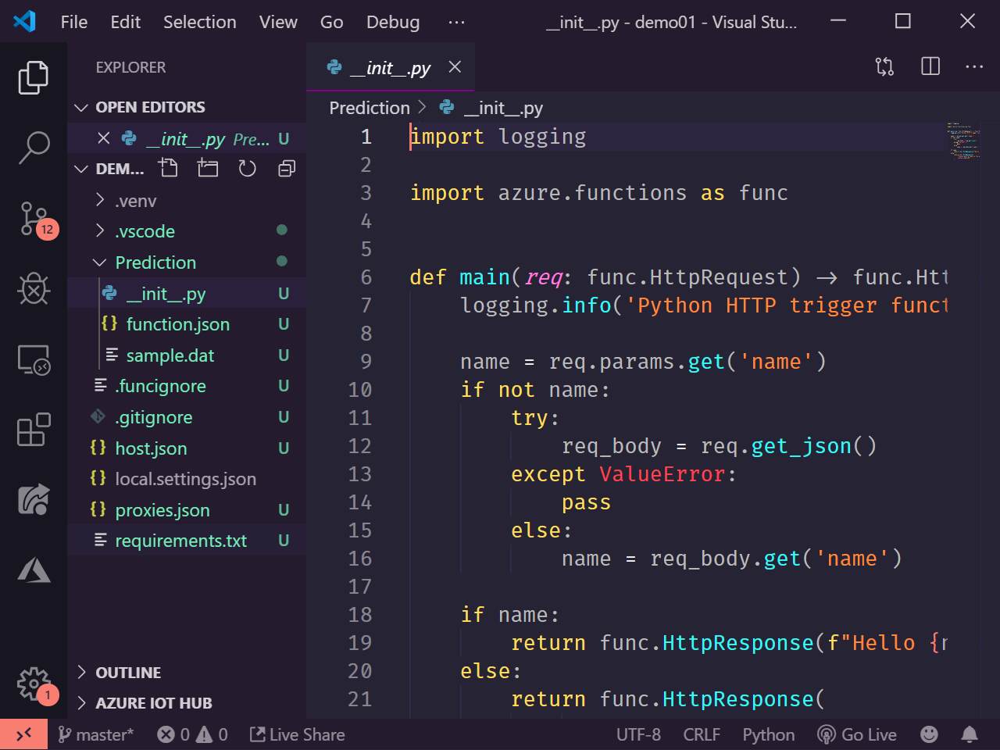

Sachez que le projet que vous venez de créer peut contenir d'autres functions, quelque soit leur trigger mais avec 
le même langage de programmation. Si vous souhaitez ajouter une nouvelle fonction, vous pouvez le faire 
via la commande `Azure Functions: Create Function...`

### Tester et débugguer votre projet

Avant d'aller plus loin, nous allons tester que vous pouvez exécuter et débugger votre projet.
Si votre environnement de développement est correctement installé, vous devriez pouvoir lancer la commande 
`Debug: Start debugging` (_F5_) et l'hôte Azure Functions va alors se lancer. Vous verrez apparaître dans le terminal
l'adresse HTTP locale à laquelle vous pouvez tester votre API.

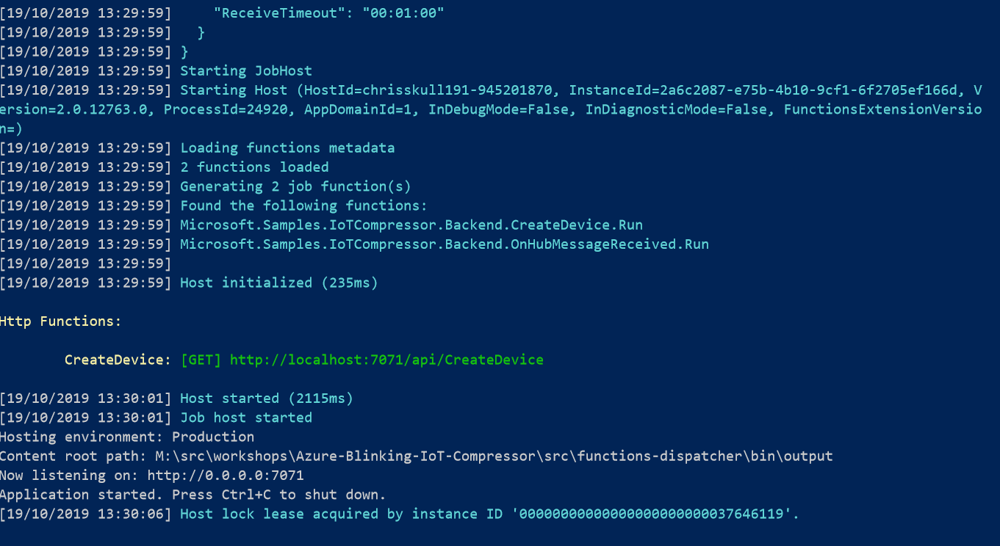

## Créer une Azure Function ⚡ dans le portail Azure 👩‍💻

Développer dans le portail n'est pas l'option recommandée pour un projet de production. 
Vous pouvez également [développer votre fonction dans Visual Studio Code](#creer-une-fonction-dans-vs-code).

### Créer l'application

Avant de créer une fonction, vous devez tout d'abord créer un application. Depuis le 
[portail Azure](https://portal.azure.com?wt.mc_id=blinkingcompressor-github-chmaneu)
, cliquez sur le bouton (+) en haut à gauche, recherchez "function" et choisissez "Function App". Vous pouvez également
utiliser le 
[lien direct](https://portal.azure.com/?feature.customportal=false&wt.mc_id=blinkingcompressor-github-chmaneu#create/Microsoft.FunctionApp)

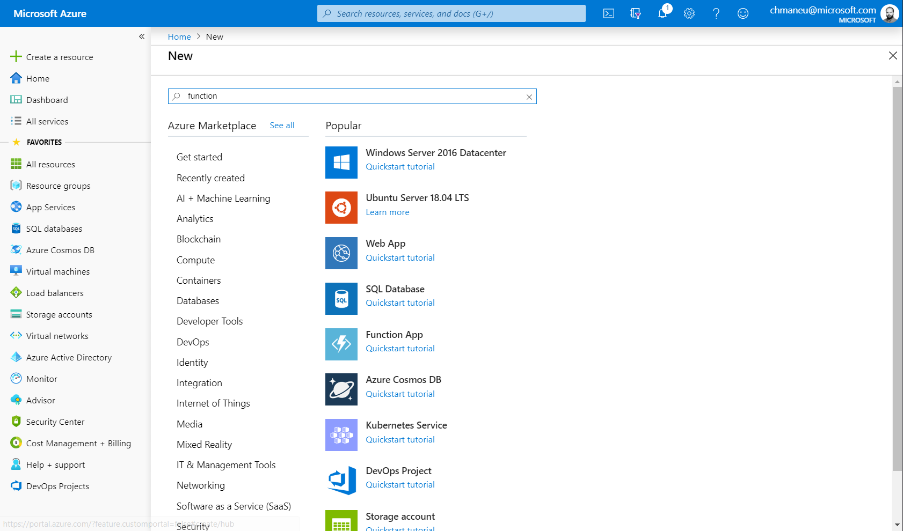

Une fois sur l'assistant de création, vous aurez un certain nombre de questions auxquelles répondre: 

- **Un nom d'application**: ce nom servira également à générer une adresse en `mafonction.azurewebsites.net`. Il doit donc
être unique sur l'ensemble des utilisateurs d'Azure,
- **Un abonnement**: normalement, vous ne devriez avoir qu'un seul choix. Dans un contexte d'entreprise, il n'est pas rare
d'avoir plusieurs abonnements - pour séparer les environnements par exemple,
- **Un resource group**: chaque ressource dans Azure doit être placée dans un conteneur logique. C'est le resource group,
- **Un Système d'exploitation**: Windows ou Linux. Cela influencera la liste des langages supporté,
- **Un plan**: C'est le mode de déploiement de la fonction. Sélectionnez _Consommation/comsumption_, ce qui vous permet
d'avoir une facturation à l'usage, ainsi qu'un auto-scaling,
- **La stack**: Node.Js, Java, .NET Core, Python. Faites votre choix ! 
- **Un emplacement**: Cela correspond à la zone dans laquelle votre fonction sera déployée. On vous recommende _France 
Central_ ou _Europe de l'Ouest_,
- **Un stockage**: laissez l'assistant en créer un. Il sert notamment à aggréger les logs et synchroniser les différentes
instances qui hébergeront votre fonction.

Il vous suffit alors de cliquer sur le bouton **Create** pour lancer la création de l'application. Vous pouvez suivre
l'évolution en cliquant sur l'icône en forme de cloche en haut à droite.

::: tip Note
Un nouvel écran de création d'une Function App est en cours de déploiement. Bien que le design ait changé, 
les questions
posées sont identiques.
:::

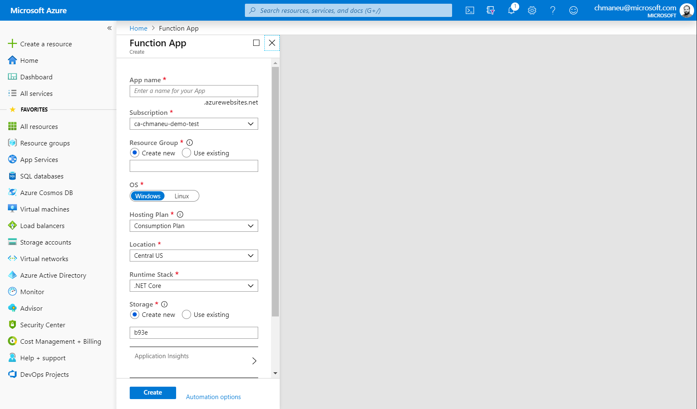

Une fois l'application de function créée, vous serez alors en mesure de créer votre première fonction. Dans l'assistant
qui s'affiche, sélectionnez le mode d'édition **In-portal**. On vous proposera alors un type de modèle, choisissez
_Webhook + API_.

<div class="img-inline">


</div>

### Coder et tester dans le navigateur

Vous aurez alors accès à un éditeur de code. Le bouton "Save" vous permet d'enregistrer vos modifications sur le serveur
et de les déployer directement. Le bouton "Run" vous permet d'exécuter votre fonction, tout en voyant les logs en bas 
de la page et la requête à exécuter à droite.

::: warning Attention
Les raccourcis claviers, comme _Ctrl+S_ ne fonctionnent pas dans le navigateur. Oui c'est assez frustrant :).
:::

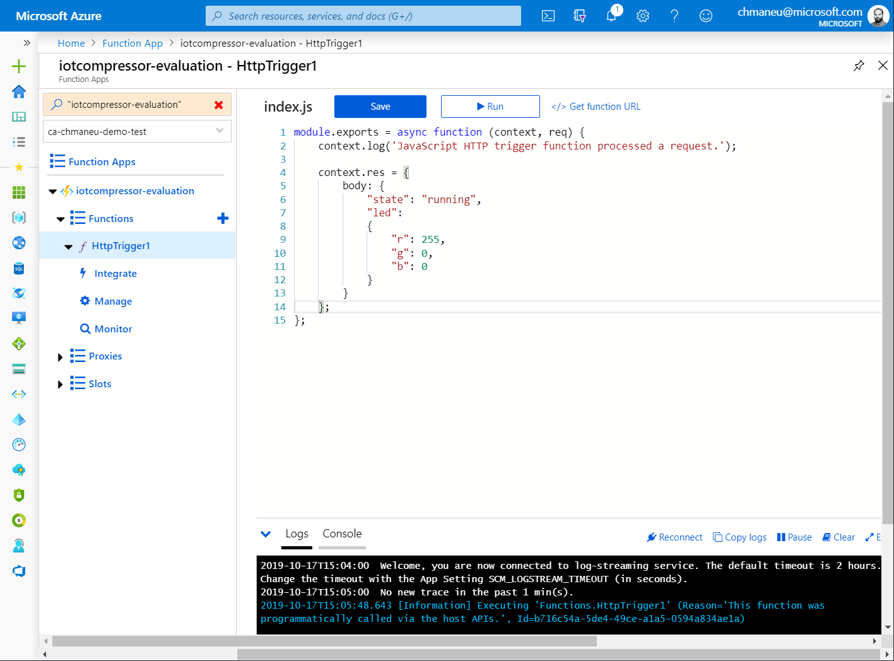

Vous pouvez maintenant passer à l'étape de coder la fonction de prédiction d'activité du compresseur.

## Ecrire du code pour détecter l'activité du compresseur

Nous voulons maintenant écrire un "algorithme" qui permettra de détecter d'après les données de télémétrie si 
le compresseur est en fonctionnement ou pas. Nous vous laissons le soin de concocter l'algorithme !
Il sera exposé sous la forme d'une API REST, et sera appelée automatiquement par le _dispatcher_ que 
nous avons créés.

### Input / Output

Votre API REST sera appelée par le dispatcher via une requête POST, avec le body suivant: 

```json
{
    "deviceId" = "device-42",
    "temperature" = 27.13,
    "humidity" = 50.2,
    "pressure" = 1004.8
}
```

Votre API doit retourner un JSON indiquant l'état du compresseur, ainsi que la couleur de la LED à afficher. L'idée est
d'avoir une LED verte quand le compresseur est éteint (aucun risque), puis rouge quand il est en fonctionnement 
(_attention, compresseur sous tension_).

Le format de sortie attendu est le suivant: 

```json
{
    "state": "running",
    "led": 
    {
        "r": 0,
        "g": 255,
        "b": 0
    }
}
```

La propriété `state` peut avoir comme valeurs `running` ou `idle`. Les valeurs de la led doivent être entre 0 et 255.

### Quelques exemples d'API

Si vous voulez tester une API déjà réalisée, voici quelques endpoints.

```
https://iotcompressor-evaluation.azurewebsites.net/api/AlwaysGreen
https://iotcompressor-evaluation.azurewebsites.net/api/AlwaysGreen
https://iotcompressor-evaluation.azurewebsites.net/api/AlwaysRed
https://iotcompressor-evaluation.azurewebsites.net/api/Prediction?code=7j3bnVqlu2/KDArv8uTXadNfLqcNaTQEsIWeDTMvsD/8NL2sNQJoag==
```

### Quelques exemples de code

#### JavaScript

Cet exemple de JavaScript va simplement retourner que le compresseur est tout le temps
en fonctionnement, et affiche une couleur de led rouge si la température dépasse les 30°.

```javascript
module.exports = async function (context, req) {
    context.log('JavaScript HTTP trigger function processed a request.');
    
    var temperatureRed = 0;
    if (req.body && req.body.temperature > 30)
    {
        temperatureRed = 255;
    }

    context.res = {
            body: {
                "state": "running",
                "led": 
                {
                    "r": temperatureRed,
                    "g": 0,
                    "b": 0
                }
            }
        };

};
```

## Déployez votre fonction dans Azure ☁️

Votre fonction est désormais prête pour le prime time ? Allons la déployer sur Azure !

> Comme indiqué précédemment, nous allons ici la déployer sur Azure, mais nous pourrions la déployer
sur d'autres environnements.

### Vous l'avez développé dans le portail Azure

Si vous avez écrit votre fonction depuis le portail Azure, alors elle est automatiquement déployée à chaque fois que
vous appuyez sur le bouton "Save". Vous n'avez donc rien à faire !

### Déployer depuis Visual Studio Code

Si vous avez créé votre projet depuis Visual Studio Code, vous allez pouvoir de déployer directement depuis l'éditeur.
Pour cela, deux options : 
- Dans le menu contextuel sur l'arborescence, avec l'option **Deploy to Function app**,
- Depuis la barre de commandes avec la commande **Azure Functions: Deploy to Function app**.

Quel que ce choix de départ, la suite des étapes est identique.

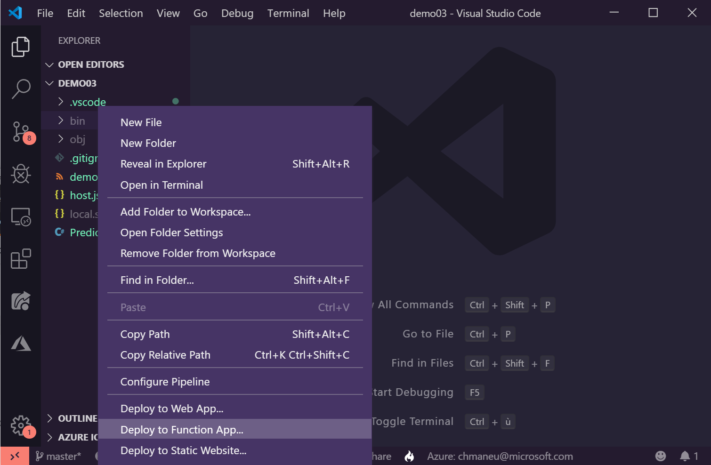
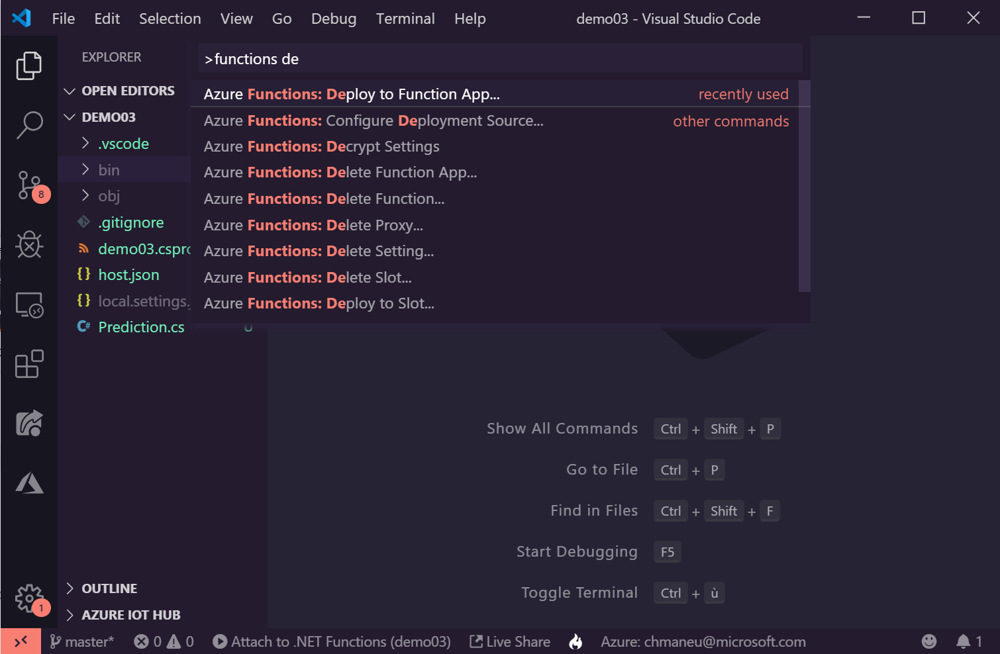

::: warning Attention
Si vous n'avez jamais utilisé Azure avec Visual Studio Code, il faudra connecter votre compte Azure à VS Code.
Un navigateur web devrait alors d'ouvrir vous demandant de vous connecter à votre compte Azure.
:::

L'assistanv de VS code va alors vous poser un certain nombre de quesitons : 

- **Dans quel abonnement déployer l'application**: normalement, vous ne devriez avoir qu'un seul choix. Dans un contexte 
d'entreprise, il n'est pas rare d'avoir plusieurs abonnements - pour séparer les environnements par exemple,
- **Dans quelle Function app?**: nous allons ici en créer une nouvelle,
- **Un nom d'application**: ce nom servira également à générer une adresse en `mafonction.azurewebsites.net`. Il doit donc
être unique sur l'ensemble des utilisateurs d'Azure,
- **Un emplacement**: Cela correspond à la zone dans laquelle votre fonction sera déployée. On vous recommende _France 
Central_ ou _Europe de l'Ouest_,

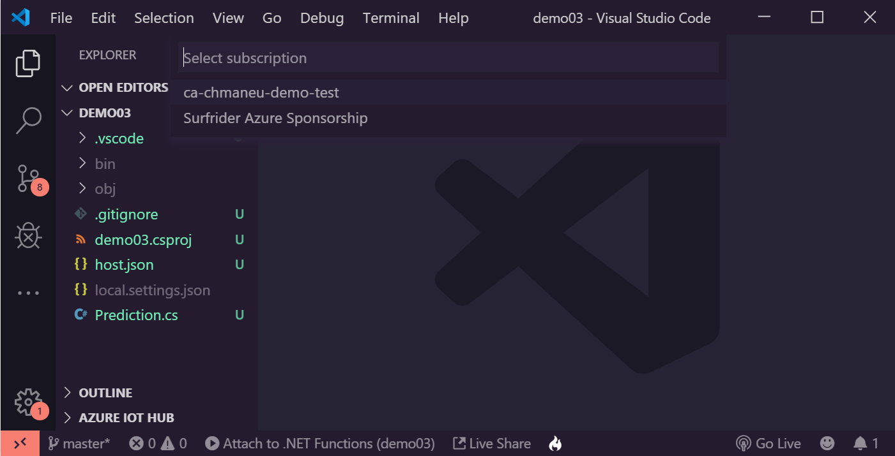
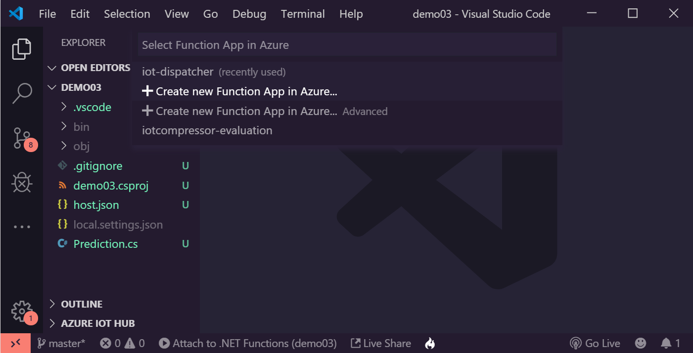
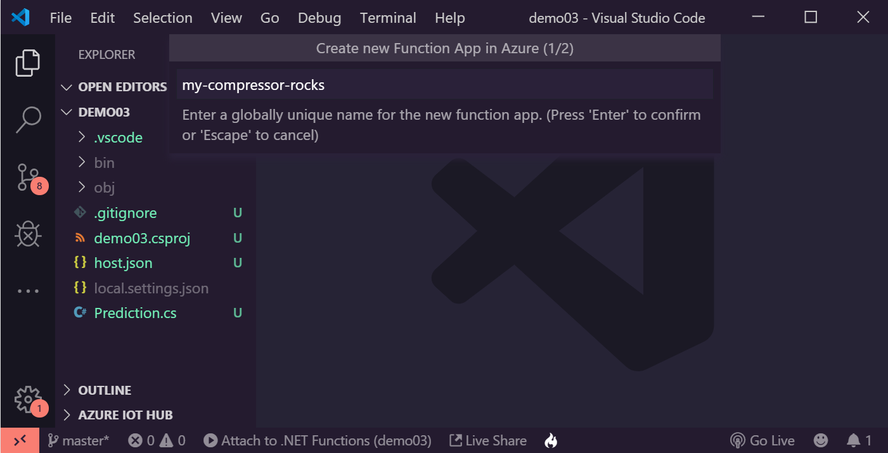
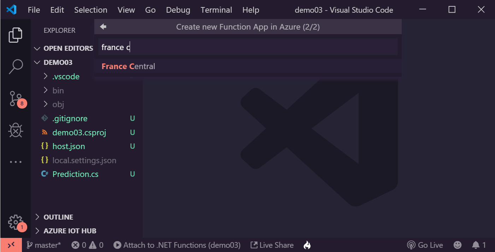

VS Code va alors déployer l'ensemble des ressources nécessaires à l'hébergement de votre application, puis déployer
votre code dans cette application. Cela peut prendre quelques minutes.

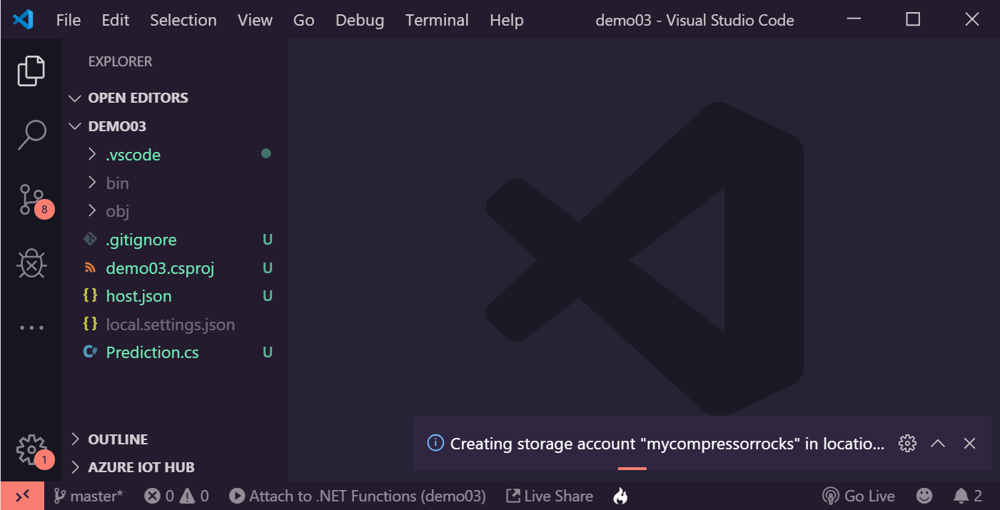

::: tip Note
Si vous avez effectué une modification de code et que vous souhaitez déployer une mise à jour, il suffit de suivre
les mêmes étapes, mais en sélectionnant l'applicaiton Azure Function déjà créée dans la liste.
:::

### Déployer depuis la ligne de commande ou la CD/CI


En environnement de production, il est rare de déployer ces ressources via un clic-droit. Il est possible de déployer
des Azure Functions depuis une ligne de commande ou bien depuis un pipeline de CD/CI.

### Récupérer l'URL de la fonction

Via la barre "Azure" (celle avec un logo A dans la barre latérale gauche), il est possible d'explorer l'ensemble des
Azure Functions de ses souscriptions. Un clic droit sur la fonction permet alors de récupérer l'URL à appeler.

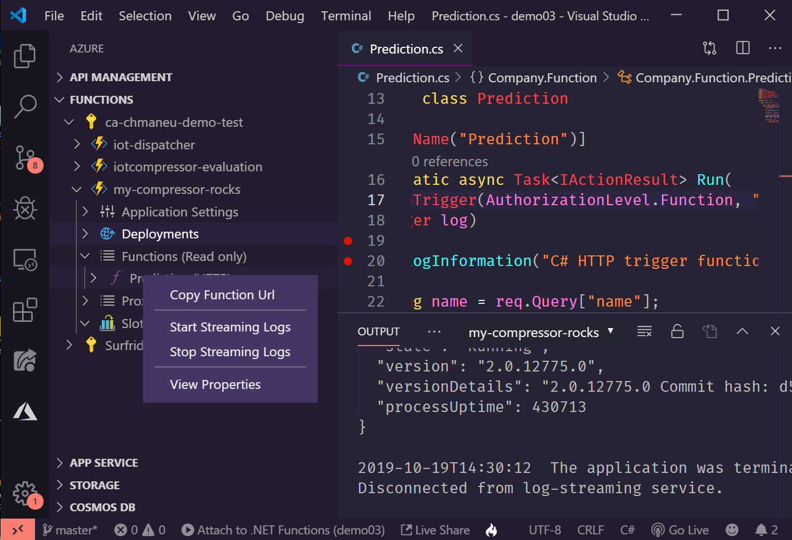

Si vous avez choisi un mode d'autentification `Function`, cette URL contiendra alors directement la clé d'API.

### Streamer les logs depuis Azure

Une fois votre fonction déployée, il est possible de streamer ces logs directement depuis Visual Studio Code.
Pour cela, il suffit de cliquer sur le bouton dans la notification ou d'utiliser la commande 
**Azure Functions: Start Streaming Logs**.

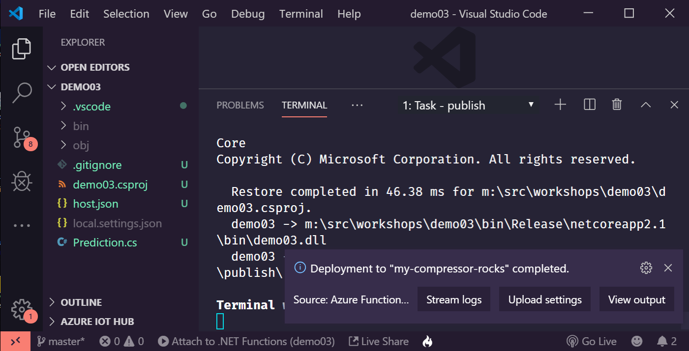

## Connectez votre function à Tailwind Diving 🏭

Maintenant que votre Azure Function de prédiction est prête, il est temps de la connecter au service !
Comme indiqué précédemment, nous avons déjà connecté votre board à Azure. Il faut donc maintenant
que notre système connaisse votre board afin de pouvoir appeler votre fonction à la réception
d'une nouvelle donnée de télémétrie.


### Récupérer l'adresse de son Azure Function

L'adresse de votre Azure Function est composée de différentes parties : 
- Le nom de votre application (choisi au moment de la création), suivi de `azurewebsites.net`,
- un préfixe, souvent `api`,
- le nom de votre méthode,
- si votre fonction est protégée, la clé de fonction (propre à chaque fonction), ou une des _master keys_ permettant 
d'accéder à l'ensemble des fonctions de l'application.

Le plus simple pour récupérer l'adresse est de se rendre dans le portail Azure sur votre application. Choisissez ensuite
votre fonction et cliquez sur le lien **Get Function **.

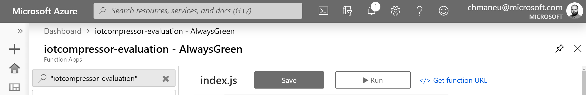

La popup qui s'ouvre alors contient le chemin vers votre fonction, et éventuellement avec la clée de fonction. Copiez
cette URL pour la prochaine étape.

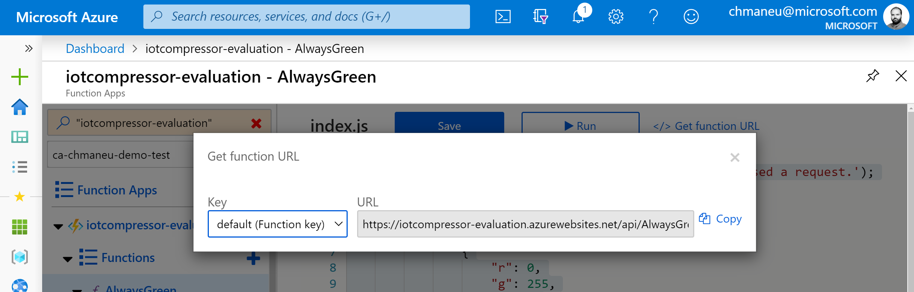

> Bien évidemment, il est possible de déployer une Azure Function avec son propre nom de domaine, mais également
> avec ses propres préfixes ou chemins. La preuve ? [maneu.fr](https://www.maneu.fr/?wt.mc_id=blinkingcompressor-github-chmaneu)
> n'est qu'une Azure Function :smiling:.

### Enregistrer son webhook

Nous avons développés un [petit site](https://backend-registrationwebsite.azurewebsites.net/) qui vous permet d'enregistrer votre webhook. Il suffit
de sélectionner votre device dans la combo (son n° est inscrit au dos de la board), et de coller l'URL de votre
Azure Function. Si vous souhaitez que votre webhook soit appelé pour test, il vous suffit de cliquer sur
"Test Callback Url".

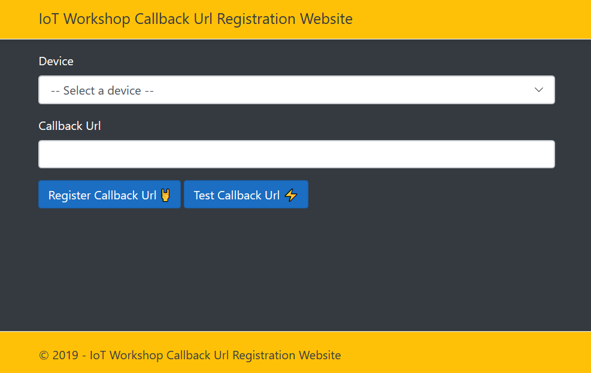
[https://backend-registrationwebsite.azurewebsites.net/](https://backend-registrationwebsite.azurewebsites.net/)

### Tester son fonctionnement

Désormais, votre Azure Function devrait être appelée à chaque réception de donnée télémétrique du device. En situation normale
(version de code 0.2), cela arrivera environ toutes les 10 secondes. Vous pouvez streamer les logs (depuis VS Code ou 
le portail) pour voir l'exécution de votre fonction. 

Pour changer les valeurs de votre board, il suffit généralement d'appliquer l'un de vos doigts sur le capteur de température.
Si cela ne suffit pas, vous pouvez frotter votre doigt contre la paume de la main pour le réchauffer.
Penez à laisser votre doigt plusieurs secondes, les données n'étant pas envoyées à chaque seconde.

### C'est réussi ?

Si votre board change bien de couleur selon votre algorithme, c'est gagné ! Passons au prochain module 🚀.
Dans le cas contraire, faites appel à l'un des assistants afin de comprendre pourquoi cela ne fonctionne pas.
