# Connectez votre board à votre IoT Hub

Jusqu'à présent, vous avez travaillé sur une solution IoT qui a déjà été créée pour 
vous à l'avance. Dans ce module, nous allons voir comment créer une solution IoT
complète à l'aide d'[Azure IoT Hub](https://docs.microsoft.com/azure/iot-hub/about-iot-hub?WT.mc_id=msroadshowwinter-event-yolasors). 
Ce service vous permet de créer de solutions IoT pouvant gérer des millions de devices, tout en vous permettant d'abstraire la complexité de communication avec
les devices IoT (Internet public, réseaux sigfox ou LoRA, etc...), ainsi que la
diversité des types de devices (Rasperry Pi, Arduino, microcontrôleurs, PC, Mobiles, ...).

Avant de poursuivre, pensez à installer l'ensemble [des prérequis](01-prepare-environment.md#module-connectez-vos-devices-iot-au-cloud) nécessaires à cette partie. Ils seront nécessaires afin de reconfigurer votre board pour qu'elle communique avec l'IoT Hub que vous allez créer.

- Créer les ressources dans Azure
- Reconfigurer votre board
- Connectez votre fonction à votre IoT Hub
- Accédez a vos devices depuis Visual Studio Code

## Créer un IoT Hub

L'IoT Hub est un service qui vous permet de gérer la connexion entre vos devices IoT et vos services hébergés sur Azure 
(ou ailleurs). Plus concrètement, il vous permet : 

- D'identifier et de recevoir des données de vos périphériques IoT - on appelle cela le _Device To Cloud_,
- D'envoyer ces données à différents applicatifs,
- De transmettre des commandes ou des données du cloud vers vos périphériques - c'est le _Cloud To Device_, 
- De mettre à jour les micrologiciels à distance de vos périphériques, voire de déployer du code à distance.

La vidéo suivante nous montre comment créer un nouveau IoT Hub. Choisissez bien le groupe de ressources créé à l'étape 
précédente, puis choisissez la région (Europe occidentale) puis un nom.

> Comme beaucoup de ressources dans Azure, leur nom devient une partie d'une adresse Internet - ici 
`monhub.chris-ioth.azure-devices.net`. Il doit donc être unique à tous les utilisateurs d'Azure !

A l'étape d'après, vous serez amené à choisir un niveau de tarification (_tier_) et une mise à l'échelle. Pour cet 
atelier, nous choisirons la taille **S1: Niveau Standard**.

> Il existe à aujourd'hui trois tiers. Le tiers gratuit est limité en nombre de messages, alors que le tiers basique ne 
dispose pas des fonctionnalités _Cloud to Device_ ou _Device Twins_ que nous allons utiliser plus loin. Le nombre 
d'unités permet quand à lui de supporter un plus grand nombre de périphériques IoT.

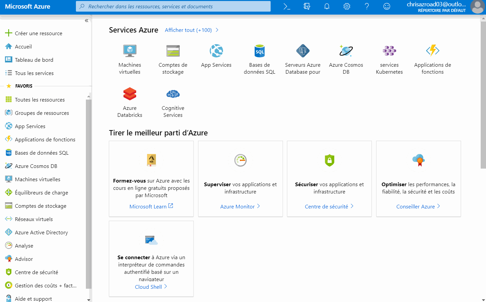

Maintenant que votre hub est créé, il vous reste à effectuer deux étapes : 

- Connecter votre carte à l'IoT Hub que vous venez de créer
- Traiter les messages reçus par votre IoT Hub 

## Connecter votre carte IoT à IoT Hub 🔌

### Créer un _device_ dans l'IoT Hub

Au sein du IoT Hub, chacun de vos périphériques IoT se doit d'être déclaré afin de pouvoir le gérer et accepter des 
données. Pour cet atelier simple, nous allons ajouter le périphérique à la main. Si nous avions à déployer des millions 
de périphériques, il y a bien évidemment [une solution][docs-deviceprov] :) Et comme tout service Azure, il existe une
API Rest - et souvent un SDK - qui permet [d'automatiser certaines tâches](https://github.com/cmaneu/Azure-Blinking-IoT-Compressor/blob/master/src/functions-dispatcher/CreateDevice.cs).

La création d'un device IoT dans le portail est assez simple. Naviguez jusqu'à l'onglet **Appareils IoT** (IoT Devices), puis cliquez 
sur **Ajouter**. Vous avez alors simplement à donner un nom à votre périphérique. Pour notre workshop, il n'y a bas besoin de 
configurer les autres options. 


Lorsque vous vous rendez sur l'écran de votre appareil IoT - en cliquant sur son nom - , vous aurez accès à deux clés ainsi que les chaînes de connexion correspondantes. **Ce sont elles qui permettent de sécuriser la connexion entre votre appareil et Azure**. 

::: warning Attention
Il est important **de ne pas les diffuser ou les mettre dans votre code source (ou repository Github)**. Nous verrons juste après comment la déployer sur la carte.
:::

::: tip Note
**Pourquoi il y a-t-il deux clés et non pas une ?** C'est pour permettre la rotation de clés, une bonne pratique en matière de sécurité.
:::

**Notez cette clé d'accès quelque part** ou gardez la fenêtre ouverte, nous allons l'utiliser dans quelques instants.

### Configurer la chaîne de connection sur votre board

Il faut maintenant _donner_ cette clé d'accès à la board. Il existe un emplacement mémoire spécifique permettant de contenir ce genre d'informations. 

::: tip Note
La board _MXChip_ possède une puce de sécurité, permettant notamment de protéger ce genre de secrets, y compris
si le firmware était corrompu. Sa mise en oeuvre prendrait un peu de temps, et elle est irréversible. Les boards
que nous vous prêtons pour le workshop étant réutilisées, nous n'utiliserons pas cette fonctionnalité.
:::

Visual Studio Code a une fonctionnalité vous permettant très simplement d'uploader sur la board cette configuration.
Cependant, celle-ci n'est disponible que lorsque vous avez un projet _IoT Workbench_. Nous allons créer un projet
"vide". Ouvrez une nouvelle instance de Visual Studio Code, et effectuez les étapes suivantes: 

- **Azure IoT Device Workbench: Create Project...**
- Donner un nom
- Le type de board, sélectionner **Arduino**
- Template de projet: choisir **MXChip IoT DevKit with Azure IoT Hub**

Assurez-vous que Visual Studio a bien sélectionné votre type de board ainsi que le port série (émulé via l'USB).
Vous pouvez voir en bas à droite le port sélectionné. Sur l'image ci-dessous, aucun port n'est sélectionné.

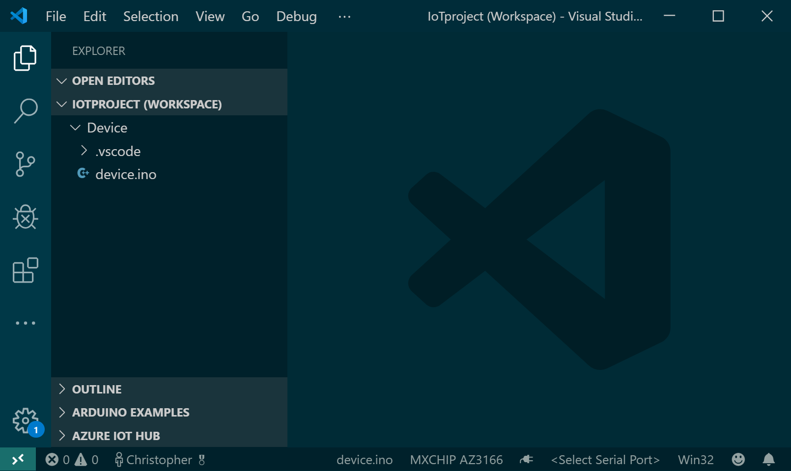

Cliquez sur `<Select Serial Port>` et sélectionnez le port COM avec la légende _ST Microelectronics_.

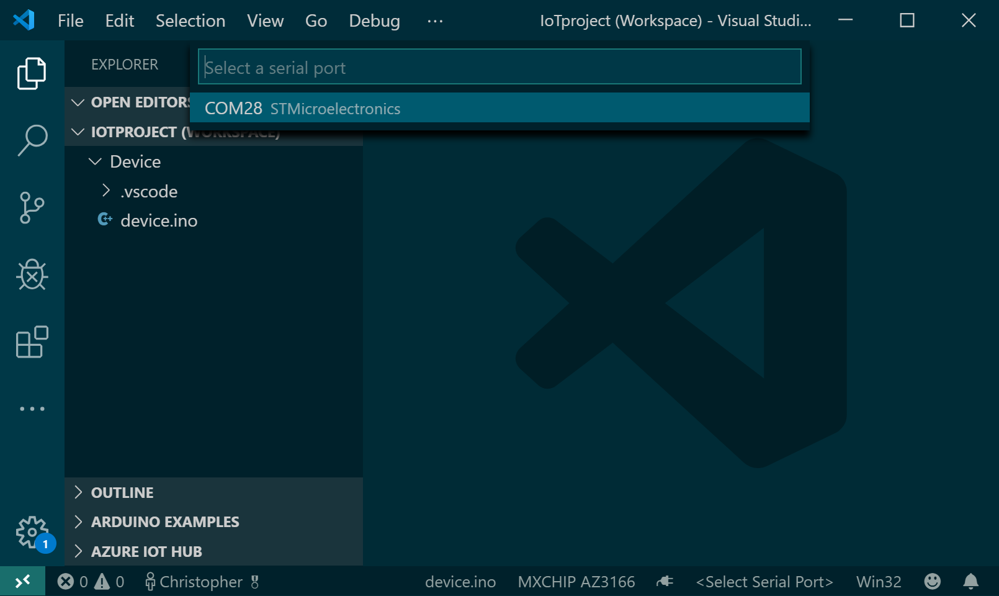

Le port sélectionné s'affiche alors en bas à droite.


Vous pouvez désormais uploader la chaîne de connexion sur la board. Pour se faire : 

1. Maintenez appuyé le bouton **A** puis appuyez et relâchez le bouton **reset** pour passer en mode configuration
2. A l'aide de la commande `Azure IoT Device Workbench: Configure Device Settings`, choisissez `Config Device Connection String`,
 puis `Input IoT Hub Device Connection String`, et collez la connection string complète générée au début de l'atelier.

Une notification de confirmation va apparaître dans Visual Studio Code. Vous pouvez maintenant redémarrer votre board.

### Tester la connexion entre les deux

Une fois que votre board a redémarrée - vous pouvez appuyer sur le bouton physique **reset** pour le forcer, vous pouvez voir sur l'écran de la board si les envois de messages sont réussis. Le message `Update #99 sent` 
apparaît alors (avec un numéro séquentiel à la place de 99).

Dans la prochaine étape, nous allons reconnecter votre Azure Function avec IoT Hub pour qu'elle 
traite les messages.

[docs-deviceprov]: https://docs.microsoft.com/azure/iot-dps/?WT.mc_id=msroadshowwinter-event-yolasors

## Traiter les événement du Hub avec Azure Functions

Jusqu'à présent, nous vous avions abstrait une partie de la complexité - et des services - 
nécessaires pour réaliser l'architecture. Comme vous pouvez le voir sur le schéma ci-dessous,
une Azure Function ne peut pas consommer directement des messages provenant de l'IoT Hub.

Pour se faire, nous devons passer par un autre service, **Azure Event Hubs**. C'est un service
d'ingestion de données en temps réel, simple et hautement scalable (on peut parler facilement
de millions d'événements par seconde). L'API est propriétaire (avec des SDK opensources pour
de nombreux langages), mais il est également possible de l'utiliser avec une API Kafka 
(Event Hubs peut donc être utilisé comme un service Kafka entièrement managé !).


### Créer un Event Hub

Pour utiliser un event hub, vous avez besoin de deux composants : 

- Un Namespace : C'est un conteneur pour un Event Hub (tel qu'un topic kafka). 
- Un Event Hub : C'est l'unité de scaling/processing des messages.

Commencez par créer un namespace, via le menu de création de ressources. Vous pouvez choisir
le même ressource group que précédemment. Choisissez également la même région que celle de votre IoT Hub
et Azure Function. 

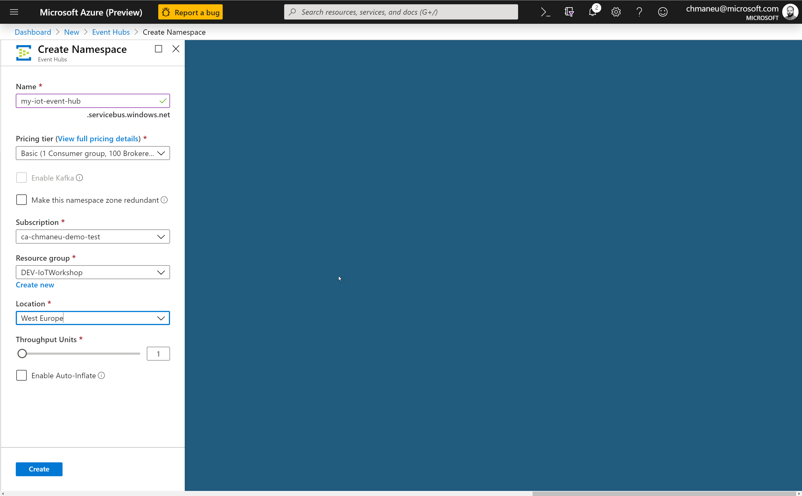

Une fois créé, il vous faudra alors créer l'Event Hub. Vous pouvez le faire via le bouton **+ Event Hub** sur
la ressource Namespace.

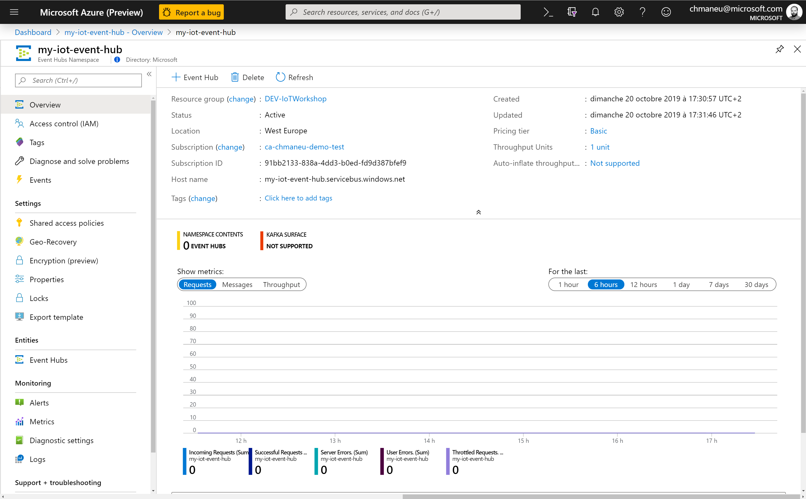
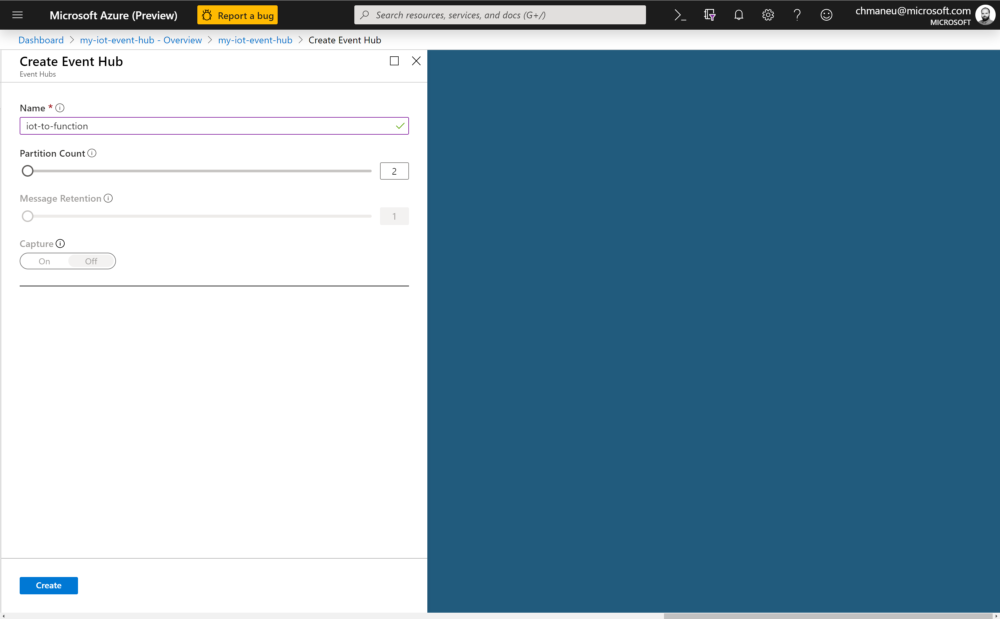

### Configurer l'envoi des messages de l'IoT Hub vers l'Event Hub

Nous allons maintenant indiquer à l'IoT Hub qu'il doit envoyer les données qu'il reçoit
vers l'Event Hub que nous avons créé. Pour cela, retournez sur votre ressource IoT Hub, et
cliquez sur **Message routing** dans le menu de gauche.

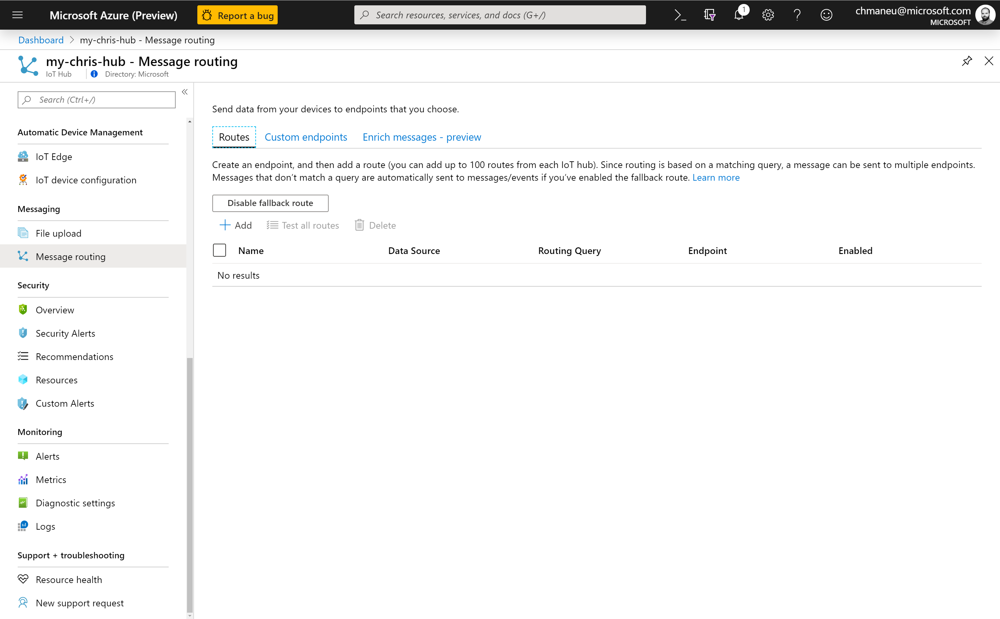

> L'exercice ici est très simple. Pour un déploiement en production, il faudrait ajuster un certain nombre
de paramètres en fonction du nombre de devices ainsi que du nombre de flux consommant les données
de l'IoT Hub - et notamment avoir le nombre de partitions en conséquence.

Vous pouvez alors ajouter une route. Il faudra choisir un nouveau endpoint de type Event Hubs.
Assurez-vous de router les messages de type `Device Telemetry Message`.

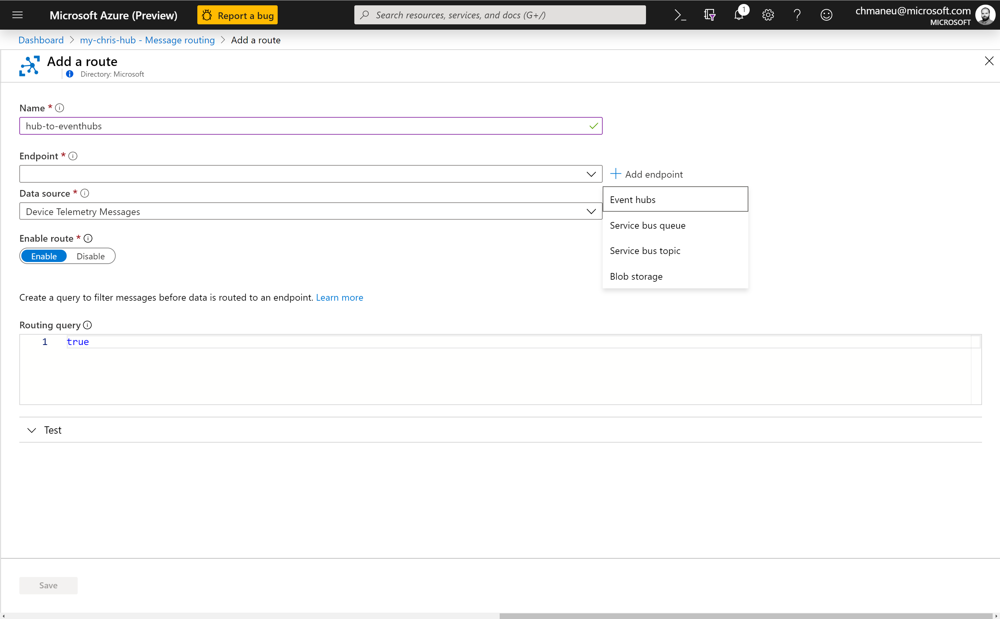
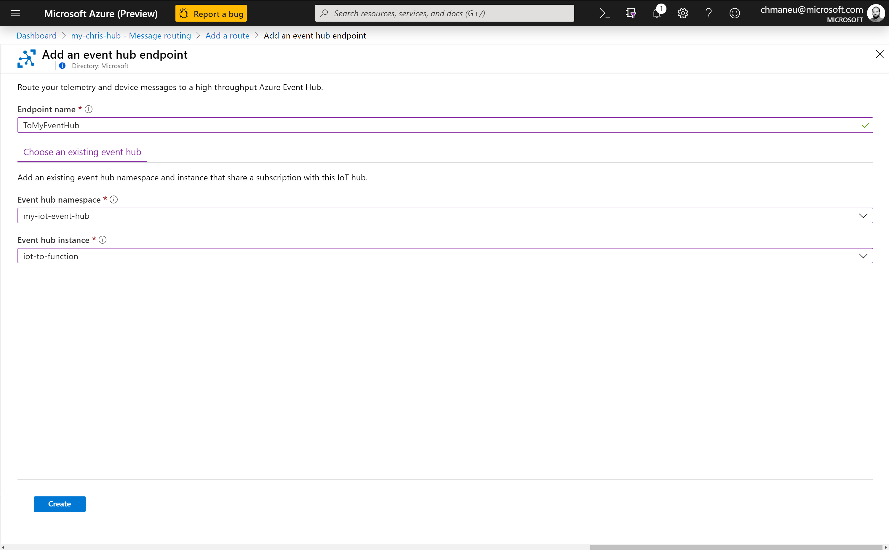

A partir de maintenant, tous les messages reçus des devices par l'IoT Hub seront renvoyés
vers l'Event hubs.

> Vous avez un peu de temps ? Créez un compte de stockage, et une route supplémentaire afin
d'envoyer également les messages sur un stockage à froid pour une analyse à postériori.

### Développer l'Azure Function pour consommer les messages de l'Event Hub

Il nous faut désormais consommer les messages provanent de l'Event Hub. Le plus simple pour cela
est de créer une nouvelle fonction - par exemple dans la même app que celle créée lors du module 2.

Vous pouvez reprendre votre projet Azure Functions et refaire les étapes en sélectionnant le trigger
`Event Hubs`. Visual Studio Code vous proposera alors de sélectionner l'Event Hub que vous souhaitez 
consommer.

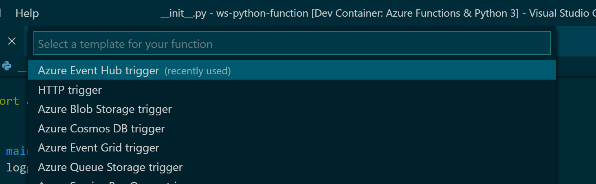
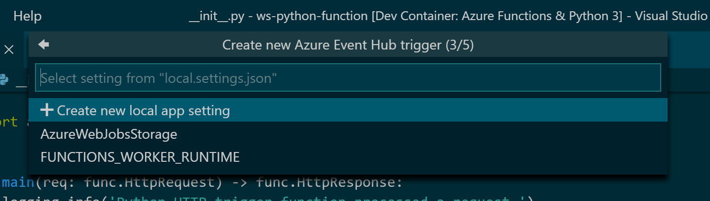
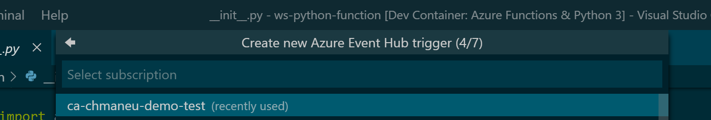
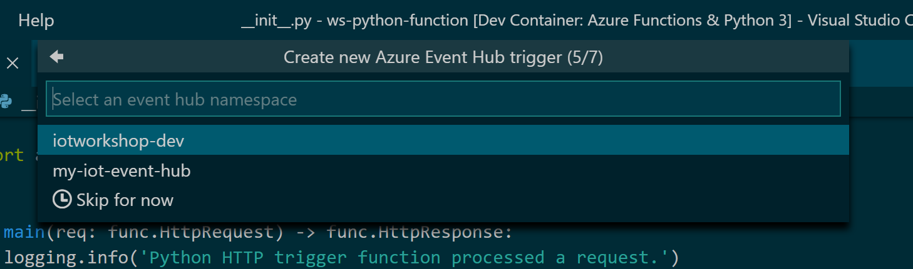
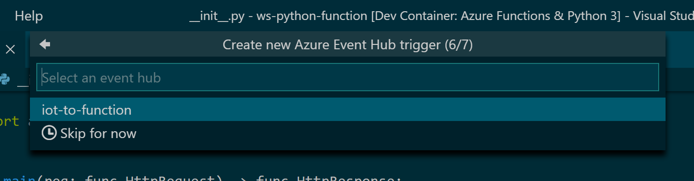
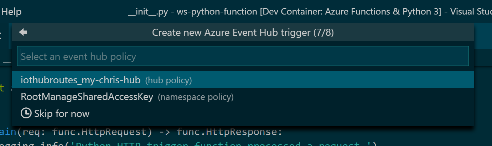
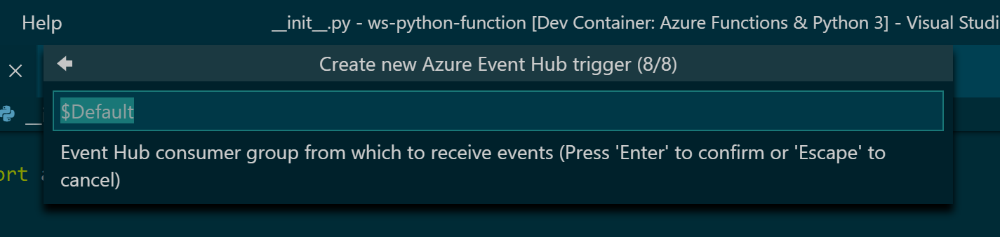

Vous pouvez réutiliser le code créé lors du module 2, mais avec quelques adaptations :).
Tout d'abord, le message que vous allez recevoir a un format différent de celui reçu au module 2.
Voici un exemple de JSON que vous allez reçevoir : 

```json
{
    "Topic": "iot", 
    "t": 25.5,
    "p": 1003.3,
    "h": 56.3
}
```

La seconde partie de code à modifier est la partie retour. Dans le module 2, vous aviez simplement
à retourner un JSON au service et la LED sur la board changeait de couleur. Pour cet exercice, il faudra
faire un peu plus de code :). Vous allez devoir modifier le Device Twin vous-même, à l'aide d'un des SDK
Service IoT Hub.

> Il existe deux types de SDK IoT Hub :
> - Le _Device SDK_, pour être utilisé côté objet connecté
> - Le _Service SDK_, pour être utilisé par les applications métiers ayant besoin de communiquer
> avec l'IoT Hub.
> 
> C'est ce second qu'il faudra utiliser. A ce propos, il existe deux chaines de connexion distinctes.
> Une pour le device - que vous avez déjà utilisé - et une autre pour le Service SDK. 

Commencez par choisir le [SDK correspondant au langage de votre Azure Function](https://docs.microsoft.com/azure/iot-hub/iot-hub-devguide-sdks?WT.mc_id=msroadshowwinter-event-yolasors#azure-iot-hub-service-sdks). A ce jour, il existe des SDKs pour Java, NodeJS, Python, .Net, C et iOs. N'hésitez pas à consulter les fichiers
`README.md` propres à chaque SDK afin de voir comment les appeler dans votre code.

Quelque soit le SDK utilisé, le principe est le même: nous allons modifier le _device twin_ de
votre board dans IoT Hub, et laisser IoT Hub appliquer la modification sur le périphérique. 
Ce device twin, qui est au format JSON, devra ressembler à cela : 

```json
{
    "properties":
    {
        "desired": 
            {
                "led": 
                {
                    "r": 100,
                    "g": 100,
                    "b": 0
                }
            }
    }
}
```

Dans votre code, il y aura alors trois étapes à réaliser : 

1. Récupérer une instance du _Registry Manager_, une connection à l'IoT Hub,
2. Récupérer la valeur actuelle du Device Twin correspondant à votre board,
3. Demander une update de ce Device Twin.

Voici un exemple de code C# permettant de réaliser ces trois étapes.

```csharp
// Etape 1 - Instance Registry Manager
string connectionString = Environment.GetEnvironmentVariable("iotHubConnectionString");
RegistryManager registryManager = RegistryManager.CreateFromConnectionString(connectionString);

// Etape 2 - Récupération du twin actuel
var twin = await registryManager.GetTwinAsync(deviceName);

// Etape 3 - Modification du twin
var patch = new
{
    properties = new
    {
        desired = new
        {
            led = new 
            {
                r = ledR,
                g = ledG,
                b = ledB
            }
        }
    }
};
await registryManager.UpdateTwinAsync(twin.DeviceId, JsonConvert.SerializeObject(patch), twin.ETag);
```

Une fois cette dernière étape réalisée, vous devriez être en mesure de traiter le message reçu de l'Event Hub
puis de modifier le device twin en fonction de votre super algorithme, et ainsi changer la couleur de la LED
par vous même. 
